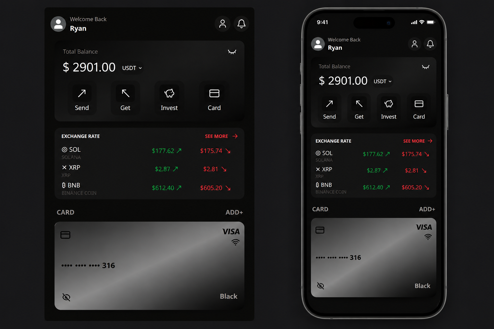

# Wallet UI

A modern and responsive digital wallet interface built with **React** and **Tailwind CSS**.

The project focuses on a clean dark-mode experience for managing balances, viewing cryptocurrency exchange rates, using a virtual card, selecting contacts, and making transfers.

## Preview



## Features

- 💰 Balance overview
- 💸 Send and receive money
- 👥 Contact selection and search
- 📊 Cryptocurrency exchange rates
- 💳 Virtual Visa card interface
- 🔄 Transaction history
- 📱 Responsive desktop and mobile layout
- 🌙 Modern dark UI
- ⚡ Built with React and Tailwind CSS

## Tech Stack

- React
- Tailwind CSS
- Vite
- Lucide React

## Getting Started

Clone the repository:

```bash
git clone https://github.com/ryankennedydev/wallet-ui.git
cd wallet-ui
```

Install dependencies:

```bash
npm install
```

Start the development server:

```bash
npm run dev
```

Then open the local URL shown in your terminal.

## Project Structure

```text
wallet-ui/
├── public/
├── src/
├── index.html
├── package.json
├── package-lock.json
└── vite.config.js
```

## Purpose

This project was created as a frontend practice project to explore React component architecture, state management, responsive layouts, and modern fintech UI design.

## License

This project is available for learning and personal use.
